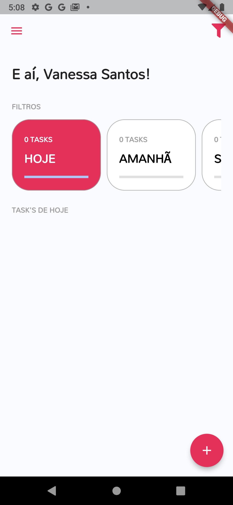
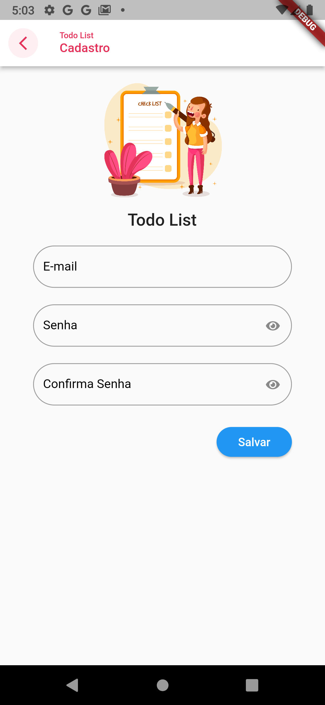
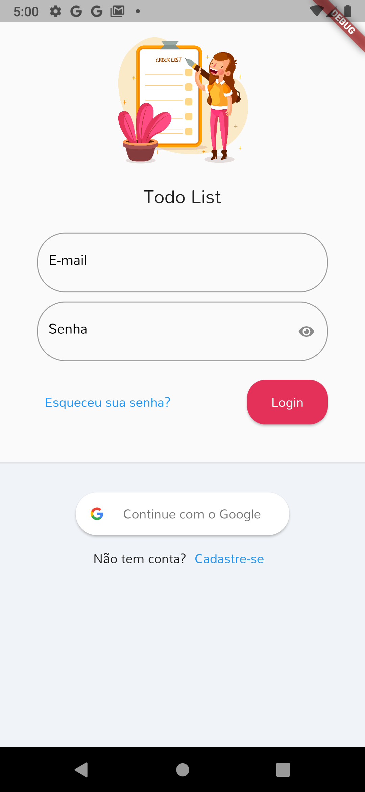

 

## 🖥️ Projeto 
Esse é um projeto feito para dispositivos móveis com intuito de descrever atividades feitas na semana. 

## 🚀 Tecnologias
Esse projeto foi desenvolvido durante a academia do Flutter com as seguintes tecnologias:

- Flutter
- Dart
- Git e Github
